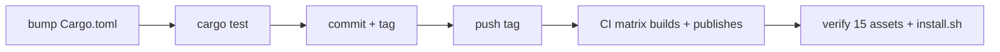

# Release agent-hooks

CI builds **every** target (`.github/workflows/release.yml`, runs on tag push). Nothing is built locally. Tag format: `v*`.


```mermaid
flowchart LR
    BUMP["bump Cargo.toml"] --> TEST["cargo test"] --> COMMIT["commit + tag"] --> PUSH["push tag"] --> CI["CI matrix builds + publishes"] --> VERIFY["verify 15 assets + install.sh"]
```

## 0. Preflight

```bash
git status --porcelain            # MUST be clean; stash or commit first
git branch --show-current         # MUST be main
grep '^version' Cargo.toml        # current version, e.g. 0.5.6
```

Pick the next version (semver): patch = fix, minor = feature, major =
breaking. New version below is `X.Y.Z`.

### Harness verification check

Ask the user: *"Have any supported harnesses shipped new versions since the
last release, or were new harnesses added? Were they verified live, and
against which version?"* For each:

- Offer to run the `verify-harness` skill for it first.
- Verified live: set `verified_against` in its `adapter.json` to that version
  (clear `unverified` if it was set).
- Not verified: leave it as is and mention it in the release notes.

Then `scripts/gen-adapter-table.py` and include the README change in the
release commit. Do not invent versions; only record what the user confirms.

## 1. Bump + commit

Single source of truth: root `Cargo.toml` `[workspace.package] version`
(all crates inherit via `version.workspace = true`).

```bash
# edit Cargo.toml: version = "X.Y.Z"
cargo check --workspace --locked  # refreshes Cargo.lock, catches breakage
cargo test --workspace            # MUST pass before tagging
git add Cargo.toml Cargo.lock README.md crates/agent-hooks-adapters/builtin
git commit -m "release: agent-hooks X.Y.Z"
```

## 2. Tag, push, let CI build

```bash
git tag vX.Y.Z
git push origin main vX.Y.Z
gh run watch   # 6 build jobs + publish
```

Tag push is the trigger (`on.push.tags: v*`); `workflow_dispatch` with an
existing tag re-runs it. Linux targets are **musl** (static, any distro).
Each build job smoke-tests (`--version`, `list-adapters --json`) the
targets it can execute natively.

## 3. Verify the release

```bash
gh release view vX.Y.Z --json assets --jq '.assets[].name' | sort
```

Expected: 15 assets, names are the contract `install.sh` / `install.ps1`
and package wrappers rely on —

```text
agent-hooks-{aarch64,x86_64}-apple-darwin.tar.gz(.sha256)
agent-hooks-{aarch64,x86_64}-unknown-linux-musl.tar.gz(.sha256)
agent-hooks-{aarch64,x86_64}-pc-windows-msvc.zip(.sha256)
SHA256SUMS, install.sh, install.ps1
```

Then prove the installer end to end against the real release:

```bash
H=$(mktemp -d); AGENT_HOOKS_HOME=$H/ah HOME=$H AGENT_HOOKS_VERSION=vX.Y.Z \
  sh <(curl -fsSL https://github.com/builtby-win/agent-hooks/releases/download/vX.Y.Z/install.sh) --no-hooks
$H/ah/bin/agent-hooks --version   # expect X.Y.Z
```

Run these smoke tests from a scratch directory, not the repo root. `self-install` only writes user-level configs (isolated by `HOME`/`AGENT_HOOKS_HOME`), but plain `agent-hooks install` also writes cwd-relative project configs (`.github/hooks/hooks.json`, `.muse/hooks.json`, ...) and will rewrite this repo's with temp paths.

If a name is wrong or an asset is missing, fix the workflow and re-run
with `workflow_dispatch`; never hand-upload.

## 4. SDK channels

The `npm` and `pypi` jobs in `release.yml` publish `builtby.win-agent-hooks` (+ six platform packages) and `builtby-win-agent-hooks` wheels from the release assets. They only run when the repo variables `NPM_PUBLISH` / `PYPI_PUBLISH` are `true` (needs the `NPM_TOKEN` secret and a PyPI trusted publisher for this workflow).

The Go SDK lives in a subdirectory module, so `go get` versions come from a prefixed tag; push it with the release tag:

```bash
git tag sdk/go/vX.Y.Z && git push origin sdk/go/vX.Y.Z
```
